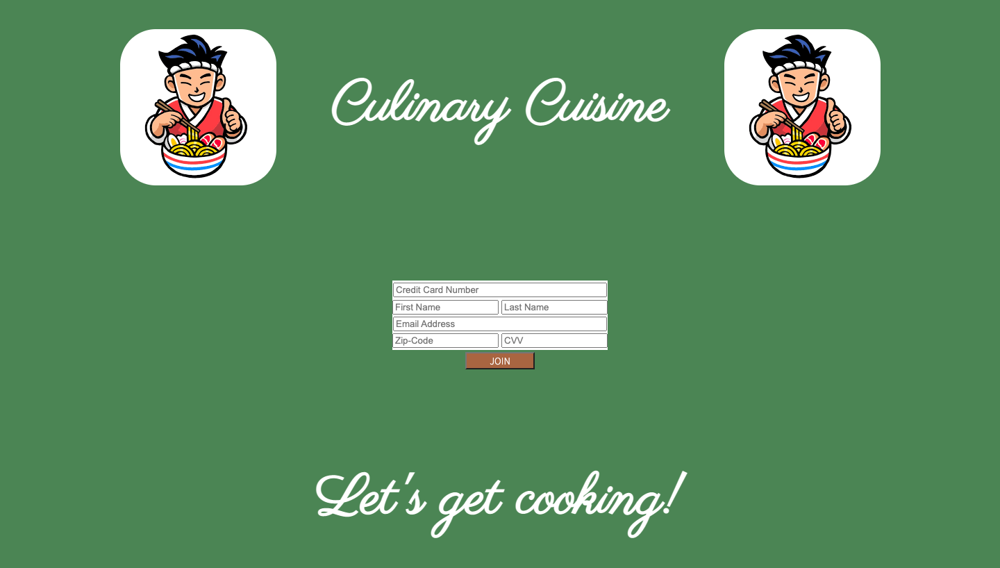

*"Culinary Cuisine"*
===========
Learn more about the developer: 

LinkedIn: https://www.linkedin.com/in/nhathoangdev/

Portfolio: https://nhoang1122.github.io/

Project Deployed On: https://foundation-capstone-hoang.herokuapp.com/

*"Culinary Cuisine"* is a fullstack subscription based web application designed to share various food recipes. An axios Get request is used to display the recipes pulling the information from a JSON database. Users may share photos of whatever they cooked with an axios post request. These user post have a like count which is updated by an axios put request.    

#### Technologies
HTML5, CSS, JavaScript, Axios, Express, JSON

#### Version 2.0

###### Search Bar
In the future, I'd like to add a search bar so users can easily filter recipe cards.

###### Filter
I'd also like the recipe cards to be displayed by category.